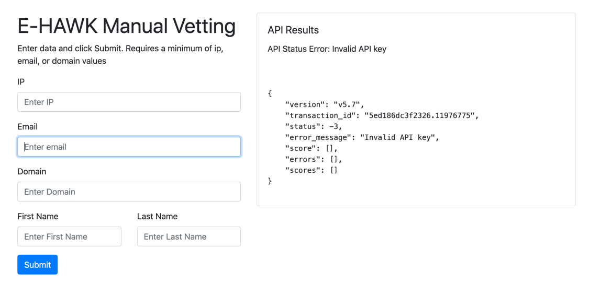

# local-api-vetting
form and process.php page to run on local network to vet data. 
Just load the form.html and process.php files into a directory on a local web server that supports php. 
MAKE SURE TO UPDATE THE process.php PAGE WITH YOUR VETTING API KEY. 
Then you can manually use the E-HAWK API from within your local network. 

